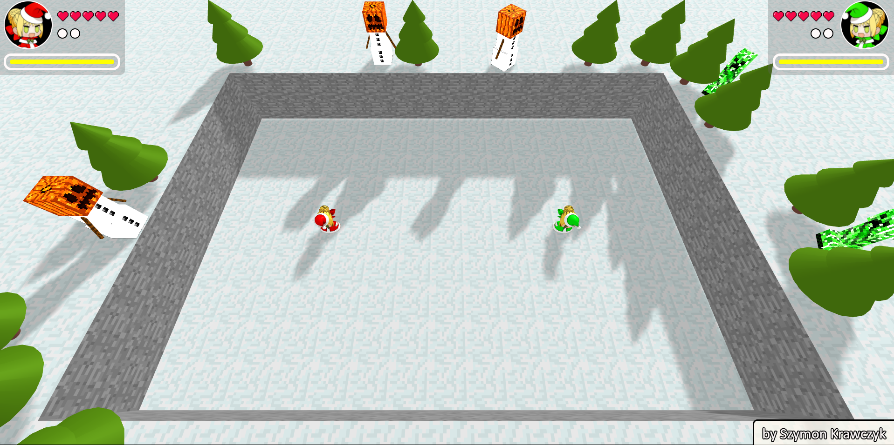
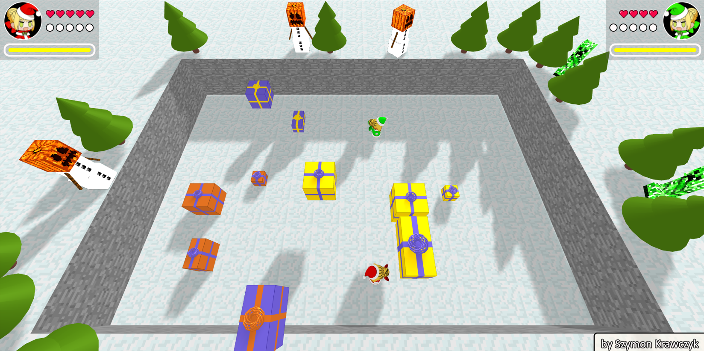
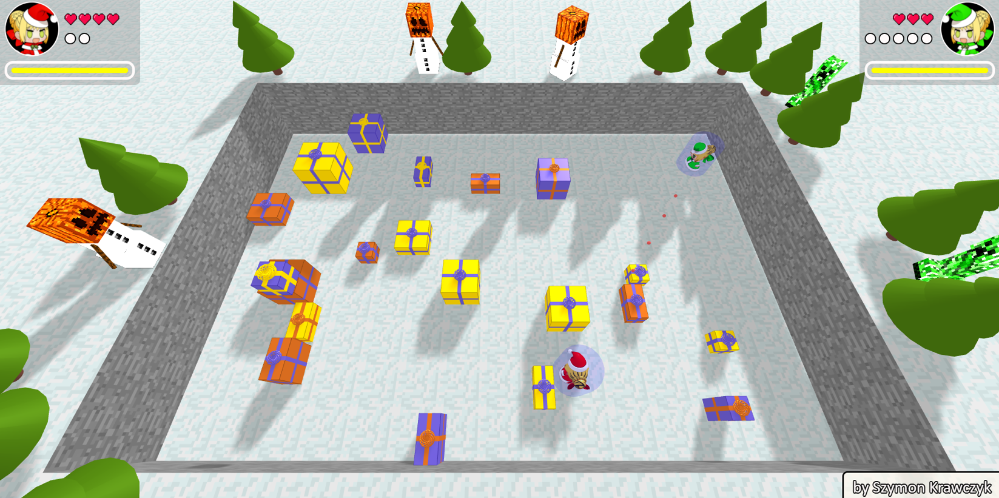
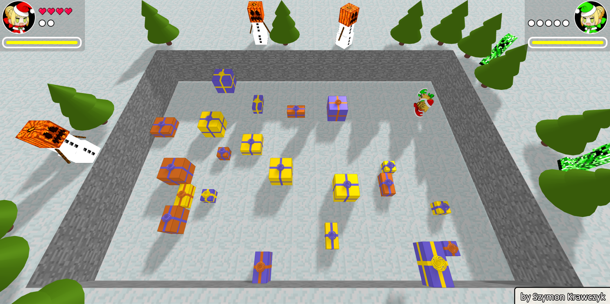
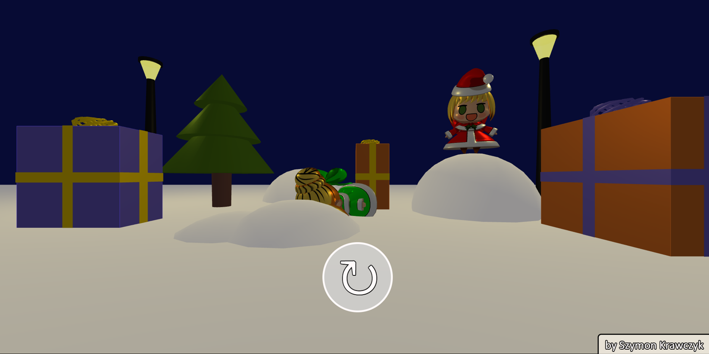

# Game made in THREE.js by Szymon Krawczyk (me)

It's a local 2 player game, where you compete to be the last one standing!
You can take damage from snowballs or presents (generated above you!)
Good luck and have fun!

Go to https://szymonkrawczyk.github.io/PadoruRoyale/ ! :)

# Screenshots

Menu

Game Start

Presents

Damage taken (temporary shield)

Player 2 is knocked out!

Player 1 won!

~~~
All models and textures belong to their owners!
~~~

Padoru model by Jinsters (I used an old version): https://sketchfab.com/3d-models/padoru-vrchat-avatar-9b43a4de6cd54722bfce699f46933f83

Padoru avatar by ManaAlchemist: https://www.reddit.com/r/grandorder/comments/9y4xul/highres_nero_padoru_vector_by_me/

Snow golem model by Vincent Yanez: https://sketchfab.com/3d-models/minecraft-snow-golem-8421d8b542ae40e0b07c43b1b17b2e27

Creeper model by Vincent Yanez: https://sketchfab.com/3d-models/minecraft-creeper-fd66182f07e5408eb04fa5a88ae16055

Snow and stone texture: minecraft

~
Szymon Krawczyk 2019
